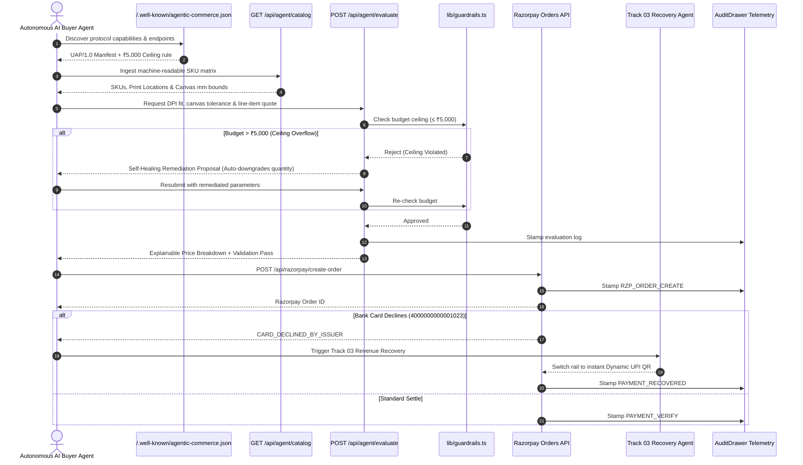

# THREAD//CORE — NPCI Unified Agentic Protocol (UAP) & ACP Specification
**Submission for Razorpay AI Buildathon 2026**
*Track 01: AI Growth & Agentic Commerce (with Track 03: AI Revenue Recovery crossover)*

---

## 1. Executive Summary

As AI agents evolve from conversational advisors into autonomous buyers, traditional human-centric e-commerce checkout flows (clicks, redirects, unconstrained carts) become major points of financial failure.

**THREAD//CORE** implements an end-to-end, machine-transactable apparel studio designed for autonomous purchasing agents operating on NPCI's Unified Agentic Protocol (UAP) and the global Agentic Commerce Protocol (ACP) standard.

### The Razorpay Standard Met:
> *"Every money action explainable, bounded and gated. Show the audit trail and one failure handled gracefully."*

* **Gated & Bounded**: Non-bypassable **₹5,000 hard ceiling** enforced directly at the API and database validation layer.
* **Explainable**: Every single rupee is transparently calculated: Garment Base + Location Surcharge + Surface Markup + 18% GST.
* **Audit Trail**: Millisecond-accurate telemetry logging every decision, DPI check, and payment capture.
* **Graceful Failure**: Two handled failure modes:
  1. *Pre-Purchase Budget Overflow*: Evaluator returns automated self-healing remediation proposing a budget-compliant configuration.
  2. *Payment Rail Interruption*: Bank card decline (`4000000000001023`) automatically triggers an instant 1-click UPI recovery fallback with zero drop-off.

---

## 2. Protocol Architecture



---

## 3. Endpoints & Data Contracts

### 3.1. Protocol Discovery
* **Endpoint**: `GET /.well-known/agentic-commerce.json`
* **Response**:
  ```json
  {
    "protocol": "NPCI-UAP/1.0",
    "compatibleProtocols": ["ACP/1.0", "AP2/1.0", "x402"],
    "merchant": {
      "id": "MERCH_THREADCORE_BLR",
      "name": "THREAD//CORE Technical Apparel Studio",
      "settlementProvider": "Razorpay"
    },
    "guardrails": {
      "currency": "INR",
      "hardCeilingPaise": 500000,
      "minOrderFloorPaise": 10000,
      "maxQuantityPerOrder": 50,
      "remediationSupported": true,
      "failoverRecoverySupported": true
    }
  }
  ```

### 3.2. Machine-Readable Catalog
* **Endpoint**: `GET /api/agent/catalog`
* Returns garment specs, dimensions in millimeters, printable canvas zones, technique markup multipliers, and available sizes.

### 3.3. Evaluation & Self-Healing Remediation
* **Endpoint**: `POST /api/agent/evaluate`
* **Request Payload**:
  ```json
  {
    "skuId": "TC-HOD-001",
    "printLocationIds": ["front-center", "back-center"],
    "printTechniqueId": "dtg",
    "quantity": 5,
    "designFileDimensions": { "widthPx": 2400, "heightPx": 2400 }
  }
  ```
* **Response (When Budget Exceeded with Remediation)**:
  ```json
  {
    "withinBudget": false,
    "budgetCeilingPaise": 500000,
    "validationErrors": ["Total ₹9,145 exceeds budget ceiling of ₹5,000"],
    "remediation": {
      "suggestedQuantity": 2,
      "suggestedPrintLocations": ["front-center"],
      "estimatedSavingsPaise": 552700,
      "newTotalPaise": 361800,
      "explanation": "Ceiling overflow detected. Self-healing proposal: adjust quantity from 5 to 2 to bring total to ₹3,618 (within ₹5,000 ceiling)."
    }
  }
  ```

### 3.4. Bounded Razorpay Order Creation
* **Endpoint**: `POST /api/razorpay/create-order`
* **Payload**:
  ```json
  {
    "amountPaise": 361800,
    "currency": "INR",
    "receipt": "TC-1725451200000-1",
    "notes": { "agentProtocol": "NPCI-UAP/1.0" }
  }
  ```
* Server enforces:
  - If `amountPaise > 500000`, returns `HTTP 403 Forbidden` with reason `Exceeds budget ceiling of ₹5,000`.
  - Generates official Razorpay Order ID (`order_...`).

---

## 4. How to Verify & Run

### Automated Test Suite:
```powershell
npm test
```
*Executes 5 automated verification suites testing math explainability, hard ceiling enforcement, quantity bounds, self-healing computation, and duplicate receipt protection.*

### Autonomous AI Buyer CLI Script:
```powershell
# 1. Normal autonomous purchase under budget
npm run agent:buy

# 2. Test hard ceiling overflow & self-healing remediation
node scripts/ai-buyer.mjs --overflow

# 3. Test bank decline simulation & Track 03 UPI recovery
node scripts/ai-buyer.mjs --decline
```

### In-Browser Autopilot Simulation:
1. Start dev server: `npm run dev`
2. Open `http://localhost:3000/studio`
3. Click the glowing **⚡ AI Autopilot** button in the header.
4. Select a persona and watch the live telemetry stream transcribe reasoning, evaluate bounds, and execute checkout.
