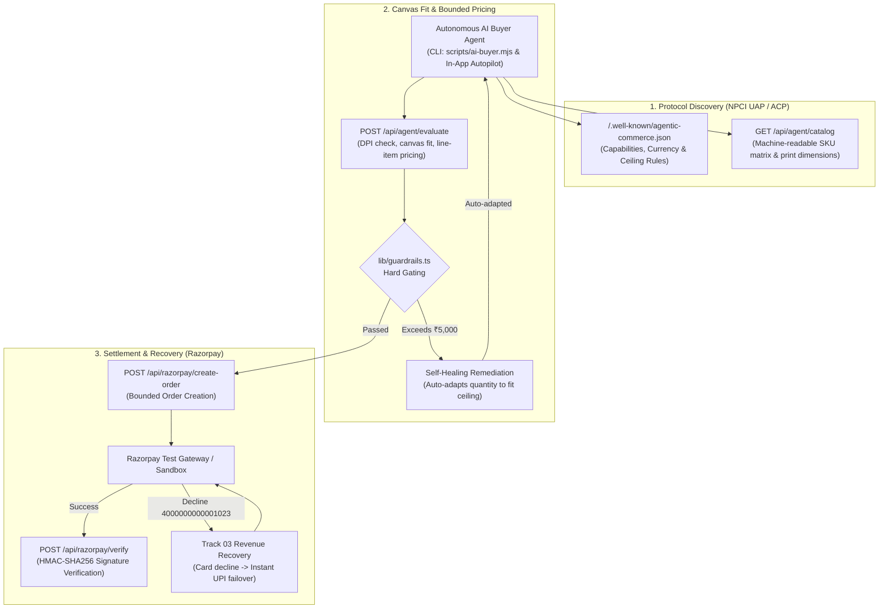

# THREAD//CORE — Agentic Commerce Apparel Studio
**Razorpay AI Buildathon 2026 Submission**  
**Track 01: AI Growth & Agentic Commerce** *(with Track 03: AI Revenue Recovery Crossover)*

---

## ⚡ The Elevator Pitch

THREAD//CORE is an autonomous, machine-transactable custom apparel studio designed for the new era of agentic commerce. Built upon **NPCI's Unified Agentic Protocol (UAP)** and the global **Agentic Commerce Protocol (ACP)**, ThreadCore enables external AI agents to discover blanks, validate 300+ DPI printability, evaluate mathematically explainable line-item costs, and settle transactions via Razorpay under strict, non-bypassable financial guardrails.

---

## 🎯 How ThreadCore Meets the Razorpay Standard

> *"Every money action explainable, bounded and gated. Show the audit trail and one failure handled gracefully."*

| Buildathon Rubric | ThreadCore Implementation | Verification |
| :--- | :--- | :--- |
| **Bounded & Gated** | Hard non-bypassable **₹5,000 ceiling** per order, ₹100 floor, 50 unit cap enforced at API & guardrail layer. | [`lib/guardrails.ts`](lib/guardrails.ts), [`tests/agent-commerce.test.mjs`](tests/agent-commerce.test.mjs) |
| **Explainable Rupee Audit** | Every single rupee is transparently calculated: Garment Base + Location Surcharge + Surface Markup + 18% GST. | [`components/studio/PriceBreakdown.tsx`](components/studio/PriceBreakdown.tsx) |
| **Audit Trail** | Millisecond-accurate telemetry logging every decision, DPI check, and payment capture in real time. | [`components/studio/AuditDrawer.tsx`](components/studio/AuditDrawer.tsx) |
| **Graceful Failure #1 (Pre-Purchase)** | If an order exceeds ₹5,000, evaluator returns an automated **self-healing remediation** proposing a budget-compliant configuration. | [`app/api/agent/evaluate/route.ts`](app/api/agent/evaluate/route.ts) |
| **Graceful Failure #2 (Payment Rail)** | Test card decline (`4000000000001023`) automatically triggers **Track 03 Revenue Recovery** failover via instant Dynamic UPI QR. | [`components/checkout/RazorpayCheckoutModal.tsx`](components/checkout/RazorpayCheckoutModal.tsx) |

---

## 🏗️ Architecture



---

## 🚀 Quickstart

### 1. Install Dependencies & Start Dev Server
```powershell
npm install
npm run dev
```
Open [http://localhost:3000](http://localhost:3000) in your browser.

### 2. Run Autonomous AI Buyer CLI Script
Simulates an external AI buyer acquiring custom apparel end-to-end:
```powershell
# Happy path autonomous purchase
npm run agent:buy

# Test budget overflow and self-healing remediation
node scripts/ai-buyer.mjs --overflow

# Test bank card decline and Track 03 UPI recovery
node scripts/ai-buyer.mjs --decline
```

### 3. Run Automated Verification Suite
```powershell
npm test
```
Verifies math explainability, hard ceiling gating, quantity limits, self-healing computation, and duplicate receipt protection.

---

## 🎨 21st.dev MCP Design System Integration

* **Shimmer Buttons**: Metallic sweep overlay across primary CTAs with spring micro-interactions.
* **Glow & Cyber Variants**: Chamfered techwear edges, glowing radar dots, and tactical monospace typography.
* **Liquid Glass Cards**: Multi-layered backdrop blur panels with dynamic hover depth reflections.
* **Multi-Angle Garment Studio**: Live SVG canvas overlay, 2.5x fabric density inspection lens, and front/back angle toggle.
* **In-App Autopilot Terminal**: Visual simulation tool in `/studio` letting judges inspect agent thoughts and telemetry without opening a shell.

---

## 📄 Documentation

* 📖 **[Protocol Specification (`PROTOCOL_SPEC.md`)](PROTOCOL_SPEC.md)**: Full technical specification of data contracts, wire formats, and state machines.
* 🎙️ **[5-Minute Pitch Video Blueprint (`PITCH_SCRIPT.md`)](PITCH_SCRIPT.md)**: Second-by-second video recording blueprint and talking points.
